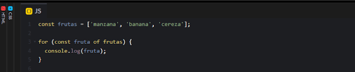

# El bucle FOR…OF

Es una estructura que te permite recorrer los elementos de una colección, como un array, de manera sencilla y legible. Es muy útil cuando quieres iterar sobre cada elemento sin preocuparte por los índices. Funciona muy parecido al bucle for in visto anteriormente. La sintaxis es exactamente la misma, la diferencia con el anterior es que el bucle for of recorre los objetos que son iterables, un array por ejemplo. En cambio el bucle for in está pensado para iterar sobre las propiedades de los objetos.

### ¿Para qué se utiliza?

Se usa principalmente para recorrer arrays, strings, mapas, conjuntos y otros objetos iterables, permitiéndote acceder a cada elemento uno por uno.

### Sintaxis

```javascript
for (const elemento of colección) {
  // código que usa 'elemento'
}

```

### Ejemplo de uso de FOR…OF

Supongamos que tienes un array de frutas y quieres imprimir cada una:

<figure><figcaption></figcaption></figure>

Este código recorrerá el array frutas y mostrará en consola cada fruta en orden.

<figure><figcaption></figcaption></figure>

### Beneficios

* Es más limpio y fácil de entender que otros bucles, como el for tradicional.
* No necesitas gestionar manualmente los índices.
* Es muy útil para trabajar con colecciones de datos.
