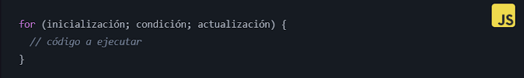

# El bucle FOR

La estructura de control **`for`** en JavaScript es muy útil para ejecutar una serie de instrucciones un número determinado de veces. A diferencia de **`while`** que usa una condición para determinar si se ejecuta o no el bloque de código, **`for`** usa un contador que se incrementa en cada iteración hasta que se cumple una condición.

### Sintaxis:

<figure><figcaption></figcaption></figure>

Importante, fíjate que for tiene tres partes separadas por **;**&#x20;

* La **inicialización** se realiza antes de que se inicie el bucle y se utiliza para declarar variables y asignar valores iniciales.
* La **condición** es una expresión booleana que se evalúa antes de cada iteración del bucle. Si la expresión se evalúa como true, se ejecuta el bloque de código dentro del bucle. Si la expresión se evalúa como false, el bucle termina.
* La **actualización** se utiliza para actualizar el valor de la variable de control del bucle después de cada iteración. Normalmente, se incrementa o decrementa el valor de la variable de control del bucle.

### Ejemplo de uso de FOR:

El siguiente ejemplo muestra cómo se puede usar for para imprimir los números del 1 al 10:

<figure><figcaption></figcaption></figure>

* La **inicialización** es la declaración de la variable number y la asignación del valor 1.
* La **condición** es que mientras number <= 10, se itera el bucle.
* La **actualización** es number++ que incrementa el valor de number en 1 después de cada iteración.

El resultado en pantalla quedaría:

<figure><figcaption></figcaption></figure>

#### Incrementando números con ++:

El operador `++` nos permite incrementar el valor de una variable número en 1. Por ejemplo, si tenemos la variable i con el valor 5, `i++` incrementaría el valor de i en 1, es decir, i pasaría a valer 6.

<figure><figcaption></figcaption></figure>

Es una forma abreviada de escribir `i = i + 1`. Y, como ves, es la forma más típica de usar en bucles como for para no tener que escribir `i = i + 1` cada vez.

El método for en JavaScript también se puede utilizar para iterar al revés Para ello, se utiliza la sintaxis `i--` en la sección de actualización del bucle en lugar de `i++`.

### ¿Para qué se usan los bucles for?

\- Repetir acciones de manera eficiente.

\- Iterar sobre listas o colecciones de datos.

\- Realizar cálculos repetitivos.

\- Automatizar tareas que requieren repetición.

### Beneficios de usar bucles for

\- Eficiencia: Te ahorran tiempo y esfuerzo al evitar la repetición manual de código.

\- Claridad: Hacen que tu código sea más limpio y fácil de entender.

\- Control: Te permiten especificar exactamente cuántas veces quieres que se ejecute el código.
